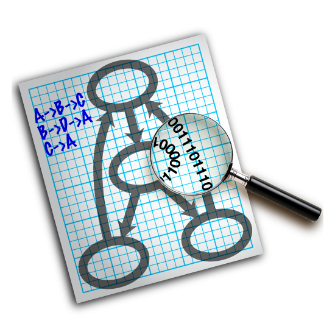

# Awesome GraphViz 

A curated list of GraphViz related resources.  

These are some representative internal and external resources.  

The list includes tools that complement Graphviz, such as graph generators, postprocessors and interactive viewers. Additional the most important internal resource are linked. It also includes higher level systems and web sites that rely on Graphviz as a visualization service. You can also find more Graphviz related projects and resources in the [more to find](#more-to-find) Section. Find the [attic.md](attic.md) for old stuff with broken links or changed content. 

You're welcome to add new stuff or report glitches.  
See [contributing.md](contributing.md) how to pull requests.  

## Table of Content
* [Graphviz Distribution](#graphviz-distribution)
  * [Introductions](#introductions)
  * [Entities](#entities)
  * [Attributes](#attributes)
  * [Layout\-Types](#layout-types)
  * [Tools](#tools)
  * [API](#api)
* [Theory &amp; Publication (tbd)](#theory--publication-tbd)
  * [Graphviz Papers (tbd)](#graphviz-papers-tbd)
  * [Graph Drawing (tbd)](#graph-drawing-tbd)
  * [Information Visualization (tbd)](#information-visualization-tbd)
* [Graphical Interfaces](#graphical-interfaces)
  * [Web\-Interface](#web-interface)
  * [Editor Addons](#editor-addons)
  * [\.NET / C\#](#net--c)
  * [Mac OS](#mac-os)
  * [Java](#java)
  * [Other](#other)
  * [Online Platforms](#online-platforms)
* [Language Bindings](#language-bindings)
  * [Libs for Node / JS / JQuery / D3](#libs-for-node--js--jquery--d3)
  * [Libs for Python](#libs-for-python)
  * [Libs for Django](#libs-for-django)
  * [Libs for Go](#libs-for-go)
  * [Libs for Java](#libs-for-java)
  * [Libs for C\# and \.NET](#libs-for-c-and-net)
  * [Libs for Perl](#libs-for-perl)
  * [Libs for Ruby:](#libs-for-ruby)
  * [Others:](#others)
  * [Confluence/Jira:](#confluencejira)
  * [CMS (Wiki/Blog):](#cms-wikiblog)
* [Generators and Translators](#generators-and-translators)
  * [Transform data sources and formats into Graphviz\.](#transform-data-sources-and-formats-into-graphviz)
  * [AI and Language Tools](#ai-and-language-tools)
  * [Network and Web Engineering Tools](#network-and-web-engineering-tools)
  * [Programming and Software Engineering Tools](#programming-and-software-engineering-tools)
    * [UML and Software\-Design &amp; \-Modelling](#uml-and-software-design---modelling)
    * [Documentation](#documentation)
    * [Call Graphs](#call-graphs)
    * [Dependency](#dependency)
    * [Schema &amp; Database Visualisations](#schema--database-visualisations)
    * [Theoretical Computer Science](#theoretical-computer-science)
    * [Others](#others-1)
  * [Bioinformatics and Cheminformatics](#bioinformatics-and-cheminformatics)
  * [Document preparation with Graphviz](#document-preparation-with-graphviz)
  * [Social Networking and Collaborative Work](#social-networking-and-collaborative-work)
  * [Third\-Party Distributions](#third-party-distributions)
* [Package Search and Further Collections](#package-search-and-further-collections)
  * [Packages](#packages)
  * [More to find](#more-to-find)

## Content

### Graphviz Distribution

#### Introductions
- [Homepage](https://graphviz.org/) - The official Homepage.
- [sourcecode](https://gitlab.com/graphviz/graphviz/) - The master GIT Repository for graphviz.
- [About Graph Visualisation](https://www.graphviz.org/about/) - A Summary about Graph Visualisation.
- [Wikipedia- Graphviz](https://en.wikipedia.org/wiki/Graphviz) -  Wikipedia page about Graphviz.
- [Wikipedia- DOT](https://en.wikipedia.org/wiki/DOT_(graph_description_language)) -  Great starter into the DOT / GV Language.
- [Changelog](https://gitlab.com/graphviz/graphviz/blob/master/ChangeLog) - Changelog starting from March 13, 2000.

#### Entities
- [Syntax](https://graphviz.org/_pages/doc/info/lang.html) - The DOT Language.
- [Node](https://graphviz.org/_pages/doc/info/shapes.html) - A node is the primary 1st class element in a graph.
- [Edge](https://graphviz.org/_pages/doc/info/arrows.html) - An edge connect two nodes.
- [Graph]() - All entities are placed within a graph or digraph (tbd).
- [Cluster/Subgraph](https://graphviz.org/_pages/Gallery/directed/cluster.html) - Devides the graph.

#### Attributes
- [All in One](https://graphviz.org/_pages/doc/info/attrs.html) - All Attributes of all Entities in one page.
- [Colors](https://graphviz.org/_pages/doc/info/colors.html) - Overview of graphviz colornames.

#### Layout-Types
- [circo]() - draws graphs using a circular layout (tbd).
- [dot](https://graphviz.org/_pages/pdf/dot.1.pdf) - draws directed graphs.
- [fdp]() - draws undirected graphs using a 'spring' model (tbd).
- [neato](https://graphviz.org/_pages/pdf/neatoguide.pdf) - draws undirected graphs using 'spring' models.
- [osage](https://graphviz.org/_pages/pdf/osage.1.pdf) - filter for drawing clustered graphs.
- [patchwork](https://graphviz.org/_pages/pdf/patchwork.1.pdf) - filter for drawing clustered graphs as treemaps.
- [sfdp]() - filter for drawing large undirected graphs  (tbd).
- [twopi]() - filter for radial layouts of graphs (tbd).

#### Tools
- GUI
  - [dotty]() - A Customizable Graph Editor - (tbd).
  - [gvedit]() - simple graph editor and viewer - (tbd).
  - [lefty]() - A Programmable Graphics Editor - (tbd).
  - [lneato]() - Editor on top of neato & lefty - (tbd).
  - [smyrna]() - interactive graph viewer - (tbd).
  - [vimdot]() - Combined text editor and dot viewer - (tbd).

- Graph Analysis
  - [acyclic]() -  make directed graph acyclic  - (tbd)
  - [bcomps]() - biconnected components filter for graphs - (tbd)
  - [cluster]() - find clusters in a graph and augment the graph with this information - (tbd)
  - [ccomps]() - connected components filter for graphs - (tbd)
  - [diffimg]() - Calculates intersection between two images - (tbd)
  - [dijkstra]() - single-source distance filter - (tbd)
  - [edgepaint]() - edge coloring to disambiguate crossing edges - (tbd)
  - [gc]() - count graph components - (tbd)
  - [gvcolor]() - flow colors through a ranked digraph - (tbd)
  - [gvgen]() - generate graphs - (tbd)
  - [gvmap]() - find clusters and create a geographical map highlighting clusters - (tbd)
  - [gvpack]() - merge and pack disjoint graphs - (tbd)
  - [gvpr]() - graph pattern scanning and processing language - (tbd)
  - [mingle]() - fast edge bundling - (tbd)
  - [nop]() - pretty-print graph file - (tbd)
  - [sccmap]() - extract strongly connected components of directed graphs - (tbd)
  - [tred]() - transitive reduction filter for directed graphs - (tbd)
  - [unflatten]() - adjust directed graphs to improve layout aspect ratio - (tbd)
    
- Converter
  - [mm2gv]() - Matrix Market-DOT converters - (tbd)
  - [gxl2gv]() - GXL-GV converters - (tbd)
  - [gml2gv]() - GML-DOTconverters - (tbd)
  - [graphml2gv]() - GRAPHML-DOT converter - (tbd)

#### API
- Language Bindings
  - [C-Code Samples]() - (tbd)
  - C libraries
    - [cdt](https://graphviz.org/_pages/pdf/cdt.3.pdf) - container data types
    - [cgraph](https://graphviz.org/_pages/pdf/cgraph.pdf) - Cgraph Tutorial
    - [gvc]() - (tbd)
    - [pack]() - (tbd)
    - [pathplan]() - (tbd)
    - [xdot]() - (tbd)
  - [Guile]() - (tbd)
  - [Java]() - (tbd)
  - [Perl]() - (tbd)
  - [PHP]() - (tbd)
  - [Python]() - (tbd)
  - [Ruby]() - (tbd)
  - [TCL/TK libraries]() - (tbd)
- Misc
  - [Build Notes](https://graphviz.org/doc/build.html) - Information on Building the sourcecode
  - [Schema Files]() - (tbd)

### Theory & Publications
#### Graphviz Papers
- [Graphviz and Dynagraph - Static and Dynamic Graph Drawing Tools](https://graphviz.org/_pages/Documentation/EGKNW03.pdf) - condensed overview ([cite](http://citeseerx.ist.psu.edu/viewdoc/summary?doi=10.1.1.96.3776))  
- [An open graph visualization system and its applications to software engineering](https://graphviz.org/_pages/Documentation/GN99.pdf) - longer overview, preferred for citation ([cite](http://citeseerx.ist.psu.edu/viewdoc/summary?doi=10.1.1.106.5621))  
- [Graph Drawing by Stress Majorization](https://graphviz.org/_pages/Documentation/GKN04.pdf) - improved algorithm for neato ([cite](https://link.springer.com/chapter/10.1007%2F978-3-540-31843-9_25))  
- [Topological Fisheye Views for Visualizing Large Graphs](https://graphviz.org/_pages/Documentation/GKN04a.pdf) - topological-based distorted views for large graphs  
- [A method for drawing directed graphs](https://graphviz.org/_pages/Documentation/TSE93.pdf) - dot's algorithm (1993) ([cite](http://citeseerx.ist.psu.edu/viewdoc/summary?doi=10.1.1.3.8982))  
- [Efficient and high quality force-directed graph drawing](http://yifanhu.net/PUB/graph_draw.pdf) - sfdp's algorithm (2005)  
- [Improved Circular Layouts](https://graphviz.org/_pages/Documentation/GK06.pdf) - crossing reduction and edge bundling for circular layouts ([cite](https://link.springer.com/chapter/10.1007%2F978-3-540-70904-6_37))  
- [Efficient and High Quality Force-Directed Graph Drawing](https://graphviz.org/_pages/Documentation/Hu05.pdf) - the multiscale algorithm used in sfdp ([cite](http://www.mathematica-journal.com/issue/v10i1/graph_draw.html))  
- [Implementing a General-Purpose Edge Router](https://graphviz.org/_pages/Documentation/DGKN97.pdf) - edge routing in Graphviz ([cite](https://link.springer.com/chapter/10.1007%2F3-540-63938-1_68))  
- [Improved Force-Directed Layouts](https://graphviz.org/_pages/Documentation/GN98.pdf) - Voronoi-based node overlap removal ([cite](https://link.springer.com/chapter/10.1007%2F3-540-37623-2_28))  
- [GMap: Visualizing graphs and clusters as maps](https://graphviz.org/_pages/Documentation/GHK09.pdf) - displaying graphs as maps ([cite](http://citeseerx.ist.psu.edu/viewdoc/summary?doi=10.1.1.154.8753))  
- [Efficient Node Overlap Removal Using a Proximity Stress Model](https://graphviz.org/_pages/Documentation/GH10.pdf) - Prism node overlap removal ([cite](https://link.springer.com/chapter/10.1007%2F978-3-642-00219-9_20))  
- [On-line Hierarchical Graph Drawing](https://graphviz.org/_pages/Documentation/NW01.pdf) - dynadag algorithm  

#### Graph Drawing
- [Wikipedia](https://en.wikipedia.org/wiki/Graph_drawing) - drawing of a graph or network diagram is a pictorial representation of the vertices and edges of a graph.
- [graphdrawing.org](http://www.graphdrawing.org/index.html) - annual symposia, books, data, open problems and more  
- [Survey](http://users.monash.edu/~gfarr/research/GraphDrawing02-Mel.ppt) - Franz Brandenburg talk notes in Powerpoint
- [Marks et al](http://www.merl.com/publications/TR2001-49/) - note on history of graph drawing
- [David Eppstein's](http://www.ics.uci.edu/~eppstein/gina/gdraw.html) - Geometry in Action
- [Graph Drawing: Algorithms for the Visualization of Graphs](https://www.amazon.com/Graph-Drawing-Algorithms-Visualization-Graphs/dp/0133016153) by Ioannis G. Tollis, Giuseppe Di Battista, Peter Eades, Roberto Tamassia  
- [Graph Drawing Software (Mathematics and Visualization)](https://www.amazon.com/Graph-Drawing-Software-Mathematics-Visualization/dp/3540008810) by M. Junger, Petra Mutzel, (Symposium on Graph Drawing 2001, Vienna)  
- [Drawing Graphs: Methods and Models](https://www.amazon.com/Drawing-Graphs-Methods-Lecture-Computer/dp/3540420622) by Michael Kaufmann, Dorothea Wagner  
- [Handbook of Graph Drawing and Visualization](https://www.amazon.com/Handbook-Visualization-Discrete-Mathematics-Applications/dp/1584884126) Roberto Tamassia, ed. [(On-line version)](http://cs.brown.edu/~rt/gdhandbook/)

#### Information Visualization
- [IEEE Infovis Symposia: current](http://vis.computer.org) - Current Symposia.
- [IEEE Infovis Symposia: past](https://www.infovis.org/) - Past Symposia.
- [Information Visualization Journal](https://www.palgrave.com/gp/journals) - Magazin for Information Visualization.
- [FlowingData](http://flowingdata.com/)**[Infothestics](http://infosthetics.com/)  
- [York U. Gallery of Visualization](http://www.datavis.ca/gallery/index.php) (see also [Statistics and Statistical Graphics Resources](http://www.math.yorku.ca/SCS/StatResource.html)).  
- [Stanford University course bilbiography](http://graphics.stanford.edu/courses/cs348c-96-fall/resources.html)[Stanford University Data Journalism](http://datajournalism.stanford.edu/)  
- [Xerox PARC projects](http://www.parc.com/)  

### Graphical Interfaces

#### Web-Interface
- [Viz-Js](http://ushiroad.com/jsviz/) - DHTML-based interactive viewer for Graphviz *Satoshi Ueyama*
- [GraphvizOnline](http://dreampuf.github.io/GraphvizOnline/) - Online Editor with Syntax Higlighting
- [Graphviz.it](http://graphviz.it) - Online-Editor with all the standard examples, based on [graph-viz-d3-js](#graph-viz-d3-js)
- [Canviz](http://www.ryandesign.com/canviz/) - an HTML5/Javascript canvas viewer (beta). *Ryan Schmidt* 
- [Graphviz Test Tool](https://sites.google.com/site/kuabus/programming-by-hu/graphviz-test-tool) - a GUI front-end for Graphviz *Hansuli Anderegg * 
- [GraphvizFiddle](https://stamm-wilbrandt.de/GraphvizFiddle/) - a dual-view Graphviz editor *Hermann Stamm-Wilbrandt* 
- [jQuery.Graphviz](https://github.com/goinnn/jquery.graphviz) - a jQuery based interactive graph viewer for graphviz svg *Pablo Martín* 
- [an AJAX viewer](https://ashitani.jp/gv/) written with Rico *T. Ashitani* 
- [Online Graphviz Generator](http://fiane.mooo.com:8080/graphviz/) - Simple Online Generator with Go Server

#### Editor Addons
- [Graphviz for vscode](https://marketplace.visualstudio.com/items?itemName=Stephanvs.dot) - Graphviz (dot) Syntax Highlight and snippets for Visual Studio Code *Stephanvs*
- [Graphviz Preview](https://marketplace.visualstudio.com/items?itemName=EFanZh.graphviz-preview) - Inline Preview inside vs code editor *EFanZh*
- [Eclipse Zest/DOT](http://wiki.eclipse.org/Zest/DOT) - an Eclipse Zest 2.0 component that can be used to render and edit DOT graphs *Fabian Steeg* 

#### .NET / C#
- [Graphviz4Net](https://archive.codeplex.com/?p=graphviz4net) provides Windows Presentation Foundation (WPF) control that is capable of rendering graph layouts using Graphviz. *Štěpán Šindelář* 
- [Wigraf](https://github.com/kml/Wigraf) - a Windows graphviz frontend based on WinGraphviz and C# .NET. "Graf" is polish for "graph." *Kamil Lemański* 

#### Mac OS
- [Instaviz](http://instaviz.com/) - graph sketching for the iPhone using Graphviz libraries for rendering. *Glen Low* 
- [Pixelglow's document-based GUI](http://www.pixelglow.com/graphviz/) for Mac OS X (slightly out of date, but won a 2004 award from Apple) *Glen Low* 

#### Java
- [idot](https://code.google.com/archive/p/idot) - an incremental Graphviz viewer (Java ≥ 1.5 with the excellent 
- [Yoix](http://www.2uwebhosting.com/) a scripting language implemented in Java with a data visualization module called YDAT that provides interactive display of GraphViz files (use -Txdot -y) *John Mocenigo* 
- [TINTFU](https://www.openhub.net/p/tintfu) - a Java-based editor for .dot graph files. *Walter Stroebel* 

#### Other
- [prefuse](http://prefuse.org/) toolkit). *Mikko Vinni* 
- [KGraphViewer](https://www.kde.org/applications/graphics/kgraphviewer/) - a KDE viewer for layouts generated by Graphviz tools. *Gaël de Chalendar* 
- [BioGrapher](http://www.bioquest.org/esteem/esteem_details.php?product_id=6509) Excel front-end (WinXP and Mac) for Graphviz that allows the user to specify graphs in a spreadsheet using adjacency matrix, node list or Newick notation (for phylogenetic trees) and visualize the layout generated by Graphviz as an Excel (vector graphics) picture object. *Rama Viswanathan* 
- [Leonhard](https://github.com/glejeune/Leonhard) - a simple viewer/editor for GraphViz, developed with MacRuby. (See the [demo](https://www.youtube.com/watch?v=nyfZVGlErTo&feature=youtu.be).) 
- [EasyGraphViz](http://wiki.cyze.jp/wiki.cgi/software?page=EasyGraphViz) - a Japanese editor for Graphviz. *Nikolaos Kavvadias*
- [NodeViz](https://code.google.com/archive/p/nodeviz) - a php framework for mapping relational data to highly styled Graphviz and displaying interactively in web clients *Greg Michalec and Skye Bender-deMoll* 

#### Online Platforms
- [Gephi](https://gephi.org/) - The Open Graph Viz Platform *Mathieu Bastian*
- [IdeaTree](https://www.ideatreelive.com:443) - a platform for concurrent, shared knowledge mapping
- [Observable](https://beta.observablehq.com/) - Common Map, Chart & Diagram creation with graphviz support
- [Bl.ock](https://bl.ocks.org/) - Common Mapp, Chart & Diagram creation with graphviz support

### Language Bindings 
 
#### Libs for Node / JS / JQuery / D3
- [viz.js](https://github.com/mdaines/viz.js/) - This project builds Graphviz with Emscripten and provides a simple wrapper for using it in the browser.
- [d3-graphviz](https://github.com/magjac/d3-graphviz) - Renders SVG from graphs described in the DOT language using the Viz.js port of Graphviz and does animated transitions between graphs. *Magnus Jacobsson*
- [graph-viz-d3-js](https://github.com/mstefaniuk/graph-viz-d3-js) - Bower component graphviz-d3-renderer renders Graphviz source in the browser with d3.js
- [d3-dot-graph](https://github.com/gmamaladze/d3-dot-graph) - This module provides D3js compatible library to parse and load files in graphviz DOT (.dot) (graph description language) format.
- [jquery.graphviz.svg](https://github.com/mountainstorm/jquery.graphviz.svg/) - jQuery plugin to make Graphviz SVG output more interactive and easier to navigate. *Rich Cooper* 
- [node-graphviz](https://github.com/glejeune/node-graphviz) - Interface to the GraphViz graphing tool

#### Libs for Python
 - [Pydot](https://github.com/erocarrera/pydot) - a python interface to Graphviz (Windows comptible). 
 - [Python-Graph](https://github.com/pmatiello/python-graph) - A library for working with graphs in Python. 
 - [PyGraphviz](http://www.lanl.gov/errors/system-notification.php) - a python interface to Graphviz similar to NetworkX. 
 - [mfgraph](https://realmike.org/blog/) - C++ interface with native bindings for python *Michael Föetsch* 
 - [GvGen](https://github.com/stricaud/gvgen) - a python class to generate dot files *Sebastien Tricaud* 
 
#### Libs for Django
 - [django-graphviz](https://code.google.com/archive/p/django-graphviz) - a Django app using Graphviz. 
 - [DjangoGraphviz](https://code.djangoproject.com/wiki/DjangoGraphviz) - Converts Django models into Graphviz DOT files. 

#### Libs for Go  
 - [gographviz](https://github.com/awalterschulze/gographviz) - a Graphviz parser for go *Walter Schulze*. 
 - [tmc/dot](https://github.com/tmc/dot) - graphviz dot language support for Go 
 - [k8sp/graphviz](https://github.com/k8sp/graphviz) - graphviz is an HTTP server which calls GraphViz to visualize a specified .dot file.
 - [paetzke/godot](https://github.com/paetzke/godot) - Godot is a graphviz wrapper for Go.
 - [gonum](https://www.gonum.org/) - Package with Gonum Graph successor of graphism/dot
 - [timtadh/dot](https://github.com/timtadh/dot) - Stream parsing of the graphviz dot language for go. *Tim Henderson*
 - [graphviz_web](https://github.com/hythof/graphviz_web) - Draw graph image by graphviz on web. 
 - [Patrolavia/godot](https://github.com/Patrolavia/godot) - generating graphviz diagram with ease
 - [graphspace](https://github.com/sigmonsays/graphspace) - graphviz workspace incl. sql-db / wb-gui for making dot graphs
 - [graph](https://github.com/lpadukana/graph) - Graphviz as a service 
 - [dotgraph](https://github.com/windler/dotgraph) - Go package to create and render graphviz dot graphs 
 - [Online Graphviz Generator](https://github.com/noselasd/gvweb) - Type in Graphviz graph language and display the generated image, see example: [web](http://fiane.mooo.com:8080/graphviz/)
 - [Graphviz as a Service](https://github.com/djmattyg007/graphviz-server) - a webserver that responds rendered graphs in PNG format.
 
#### Libs for Java
 - [Eclipse plugin](https://sourceforge.net/#!/projects/eclipsegraphviz/) 
 - [JPGD](http://www.alexander-merz.com/graphviz/): A Java parser for Graphviz documents *Alexander Merz* 
 - [Java API](https://github.com/jabbalaci/graphviz-java-api) *Laszlo Szathmary* 
 
#### Libs for C# and .NET
 - [graphviznet](https://code.google.com/archive/p/graphviznet) 
 - [CodePlex QuickGraph](https://archive.codeplex.com/) 
 - [Tigris QuickGraph](http://quickgraph.tigris.org/source/browse/quickgraph/trunk/src/) 

#### Libs for Perl
- [webdot.pl](???) in perl *Stephen North*, with a huge assist from *John Linderman* (tbd)
- [Graphviz2](https://metacpan.org/release/GraphViz2) - perl interface, supports new options *Ron Savage* 
- [GraphViz2::Marpa](https://metacpan.org/release/GraphViz2-Marpa) - a Marpa-based parser for DOT files. *Ron Savage* 
- [A Perl interface to Graphviz](http://search.cpan.org/~lbrocard/GraphViz-2.02/lib/GraphViz.pm) *Leon Brocard* 
- [Tk::GraphViz](http://search.cpan.org/~jgs/Tk-GraphViz/) - a perl module for displaying graphs in a perl/TK canvas *Jeremy Slade* 
- [Graph-ReadWrite](http://search.cpan.org/~neilb/Graph-ReadWrite/) - module that supports 'dot' syntax graphs *Neil Bowers* 
- [GraphViz::ISA](http://search.cpan.org/~marcel/GraphViz-ISA-1.100860/lib/GraphViz/ISA.pm) - graph Perl packages' ISA runtime hierarchies *Marcel Grunauer* 
- [Graph::Easy](http://search.cpan.org/~tels/Graph-Easy/) is a rectilinear graph drawing program compatible with Graphviz and written  
 
#### Others: 
- [Ruby-Graphviz](https://github.com/glejeune/Ruby-Graphviz/) - Ruby interface to Graphviz *Grégoire Lejeune* 
- [MatLab](http://de.mathworks.com/matlabcentral/fileexchange/4518?requestedDomain=true) *Leon Peshkin* 
- [R-Graphviz](#Rgraphviz) (tbd)
- [webdot](https://gitlab.com/graphviz/webdot) in TCL *John Ellson*  
 
#### Confluence/Jira: 
- [Graphviz Diagrams for Confluence](https://marketplace.atlassian.com/plugins/com.atlassian.confluence.extra.graphviz/server/overview) - Generate and display graphs based on Graph Visualization Software (Graphviz) and the DOT language. *Bob Swift*
- [Graphviz Cloud](https://marketplace.atlassian.com/plugins/com.addteq.graphviz/cloud/overview) - Create and render Graphviz diagrams for Confluence Cloud *Addteq*
- [Digraph Macro](https://bobswift.atlassian.net/wiki/spaces/GVIZ/pages/30703811/Digraph+Macro) - The Digraph Macro creates directed graphs using the Graphviz language. *Bob Swift*
- [GraphViz/PlantUML](https://avono-support.atlassian.net/wiki/spaces/PUML/overview) - Adding PlantUML Diagram in Confluence-Wiki with DOT-Language *Michael Griffel*

#### CMS (Wiki/Blog): 
- [MediaWiki-1](http://search.cpan.org/~tels/mediawiki-graph/) extension. *Tels* 
- [MediaWiki-2](https://www.mediawiki.org/wiki/Extension:GraphViz) extension *Coffman* 
- [Drupal](https://www.drupal.org/project/graphviz_filter) Graphviz filter *Karim Ratib* 
- [Wordpress EHT Graphviz](https://ociotec.com/eht-graphviz-plugin-para-wordpress/) plugin for Wordpress, to allow Graphviz images to be easily integrated into a Wordpress page. *Emilio González Montaña* 
- [Wordpress Graphviz](https://wordpress.org/plugins/wp-graphviz/) plugin for Wordpres, to allow Graphviz images to be easily integrated into a Wordpress page. * - [DeBAAT](https://profiles.wordpress.org/debaat/)* 
- [DokuWiki](https://www.dokuwiki.org/plugin:graphviz) directed and non-directed graph images from “dot�? language *Andreas Gohr* 
 
 
### Generators and Translators 
#### Transform data sources and formats into Graphviz. 
- [ExcelToGraphviz1](https://sourceforge.net/projects/relationship-visualizer/) - Relationship Visualizer - Convert Excel data into Graphviz graphs *Jeff Long* 
- [ExcelToGraphviz2](https://sourceforge.net/projects/excel-to-graphviz/) - a tool for visualizing Excel data as graphs *Matt Castelli* 
- [Graph API](https://www.drupal.org/project/graphapi/) - a Drupal graph generation module with Graphviz Dot output capabilities. *Sebastian Daniel* 
- [WorldCat xISSN](http://www.worldcat.org/xissn/titlehistory) - shows the history of a journal indexed by ISSN *OCLC Online Computer Library Center, Inc.* 
- [Linguine Maps](http://www.softwaresecretweapons.com/lm_hibernate.html) - visualize XML DTDs, Apache Object Relational Bridge Files, Apache Ant Build files, and provide a clean Java API for diagramming *Pavel Simakov* 
- [PostgreSQL AutoDoc](https://github.com/cbbrowne/autodoc) - documents the relation structure of PostgreSQL databases *Rod Taylor* 
- [DOTML](http://www.martin-loetzsch.de/DOTML/) - XML markup to mirror dot language. Includes scripts and XSLT to transform and render *Martin Loetzsch* 
- [S-DOT](http://www.martin-loetzsch.de/S-DOT/) - a Common Lisp interface to dot *also Martin Loetzsch* 
- [SqlPP](https://www.codeproject.com/Articles/4603/A-scripted-SQL-query-generation-framework-with-IDE) - a scripted SQL query generation framework that generates graphviz 

- [DBGraphNav](https://code.google.com/archive/p/dbgraphnav) - a tool to facilitate the browsing of data within relational databases. *Paul McMillan* 
- [EMF To Graphviz](https://sourceforge.net/projects/emf2gv/) - an Eclipse plugin that helps to transform an EMF model into a diagram using Graphviz. 

#### AI and Language Tools 
- [txt2graph](http://andreas-romeyke.de/txt2graph/txt2graph.html) - visualize the structure and dependencies of a text read from stdin and generates a dot-File for graphviz to stdout *Andreas Romeyke* 
- [Ontoviz](https://protegewiki.stanford.edu/wiki/OntoViz) - is a plugin for displaying knowledge base diagrams in the- [Protoge](https://protege.stanford.edu/) - system 
- [CanooNet](http://www.canoo.net/services/WordformationDictionary/Controller) - , a German word formation dictionary. (Try- [_Blockflöte_](http://www.canoo.net/services/WordformationDictionary/Controller?asp=1&input=blockfl%F6te&features=%28Cat+N%29%28Gender+F%29&lang=de&country=CH&lookup=caseInSensitive),- [_Hochschule_](http://www.canoo.net/services/WordformationDictionary/Controller?asp=1&input=hochschule&features=%28Cat+N%29%28Gender+F%29&lang=de&country=CH&lookup=caseInSensitive) or [_Massanzug_](http://www.canoo.net/services/WordformationDictionary/Controller?asp=1&input=massanzug&features=%28Cat+N%29%28Gender+M%29&lang=de&country=CH&lookup=caseInSensitive) in the entry field).
- [Topic extraction using Wikipedia data](http://blog.prashanthellina.com/topic-extraction-using-wikipedia-data.html). 
  
#### Network and Web Engineering Tools 
- [DNSViz](http://dnsviz.net/) - a DNS visualization tool 
- [TraceViz](http://hokstad.com/traceviz-visualizing-traceroute-output-with-graphivz) - Traceroute visualization with sharp-looking SVG styles *Vidar Hokstad* 
- [SMART](https://sourceforge.net/projects/safemap/) - passive network flow visualization tool *Cisco's Critical Infrastructure Assurance Group (CIAG) - Research team* 
- [CSO Online](https://www.csoonline.com/article/2122766/malware-cybercrime/what-a-botnet-looks-like.html): What a Botnet Looks like (Flash) - *David Vorel* 
- [EFnet](http://map.efnet.net) - IRC Network server routing maps *Douglas Boldt* 
- [Image_Graphviz](http://pear.php.net/package-info.php?package=Image_Graphviz) - class in PHP - *Sebastian Bergmann* 
- [phpOpenTracker](http://www.phpopentracker.de/) - provides a framework solution for the analysis of website traffic and visitor analysis. *Sebastian Bergmann* 
- [apache2dot](http://www.chaosreigns.com/code/apache2dot/) - Apache log file visualizer 
- [sig2dot](http://www.chaosreigns.com/code/sig2dot/) - generates a graph of all of the signature relationships in a GPG/PGP keyring 
- [Rocketfuel](http://research.cs.washington.edu/networking/rocketfuel/) - ISP mapper [see](http://research.cs.washington.edu/networking/rocketfuel/interactive/) - *U. Washington* 
- [DNS server visualization](http://www.zonecut.net/dns/) - Visual DNS Server.lich
- [Visitors, a fast web log analyzer](http://www.hping.org/visitors/) - uses graphviz to display usage patterns showing how users are using your web site. *Salvatore Sanfilippo* 
- [graph-tool](https://graph-tool.skewed.de/) - an efficient python module for manipulation and statistical analysis of graphs, which includes an interface to GraphViz, via its python bindings. *Tiago de Paula Peixoto* 
  
 
#### Programming and Software Engineering Tools 
##### UML and Software-Design & -Modelling
  - [Grails class diagram plugin](http://grails.org/plugin/class-diagram/) - provides an UML-like diagram of grails domain classes. *Trygve Amundsen* 
  - [UMLGraph](http://www.umlgraph.org/) - a Java tool for the Declarative Drawing of UML diagrams which generates diagrams using dot *Diomidis Spinellis* (Diomidis also contributed code for a richer set of arrow heads for dot, which he claims were really part of a stealthy plot to have Graphviz taken over by the UML community. :-) - 
  - [Compendium-TA](https://www.compendiumdev.co.uk/page.php?title=compendiumta) - an integrated package of modelling tools which uses Graphviz for graph layouts *Alan Richardson* 
  - [AsmL](https://www.microsoft.com/en-us/research/project/asml-abstract-state-machine-language/?from=http%3A%2F%2Fresearch.microsoft.com%2Fen-us%2Fprojects%2Fasml%2F) - an executable specification language from Microsoft Research. 
  - [ArgoUML Graphviz](http://argouml-graphviz.tigris.org/) - Automatically repositioning all visual elements from UML diagrams that are stored in XMI. These can be exported with DOT to PDF, SVG, PNG, etc. This XLST runs independently of ArgoUML. *Pander* 
  - [APIviz](https://code.google.com/archive/p/apiviz) - is a JavaDoc doclet which extends the Java standard doclet. It generates comprehensive UML-like class and package diagrams. 
  - [ADR](http://www.albertolluch.com/research/adr) - is a system for formal software design by means of graphical methods. *Alberto Lluch Lafuente* 
  - [PlantUML](http://plantuml.com/) - generates UML diagrams (classes, usecases, activities, components) - using a simple text description language. *Arnaud Roques* 

##### Documentation
  - [doxygen](http://www.stack.nl/~dimitri/doxygen/) - uses graphviz to produce class hierarchies and other diagrams directly from source code *Dimitri van Heesch* 
  - [IsaViz](http://www.w3.org/2001/11/IsaViz/): A Visual Authoring Tool for RDF *Emmanuel Pietriga* 
  - [Symfony application-map plugin](https://symfony.com/legacy) - an easy-to-use documentation tool for the symfony framework community. *Tomasz Ducin* 

##### Call Graphs
  - [javashot](https://code.google.com/archive/p/javashot) - captures the dynamic execution flow of a Java programa. The traces can be viewed using Graphviz. 
  - [CodeViz](https://github.com/petersenna/codeviz) - a call graph generation utility for C/C++ that assumes dot for its back end *Mel Gorman* 
  - [Python call graphs](http://pycallgraph.slowchop.com/en/master/) - Python Call Graph Visualisation

##### Dependency
    - [LJV.java](https://www.cs.auckland.ac.nz/~j-hamer/LJV.html) - (Lightweight Java Visualizer) - is tool for visualizing Java data structures with Graphviz. It has been used to good effect in CS1 and CS2-level data structures courses. *John Hammer* 
  - [eEye Binary Diffing Suite](https://www.beyondtrust.com/) - is a suite of tools for binary differential analysis, especially for reverse engineering patches as well as program updates. 
  - [YaST](https://lizards.opensuse.org/2009/01/19/graph-of-storage-devices/) - openSUSE installation and configuration showing a graph of storage devices with dependencies. *Arvin Schnell* 

##### Schema & Database Visualisations
  - [Merisedot](http://oss.phear.org/merisedot/) - a tool to generate MCD Entity/Relation graphics of Merise. (Seulement en Français) - 
  - [Pimentech-DbUtils](http://www.pimentech.fr) - utils for writing patterns databases in XML (Extended Entities Relationship diagram (ERA)) - and exporting them to graphviz and sql. 
  - [Reverse Snowflake Joins](https://sourceforge.net/projects/revj/files/) - is a tool that parses SQL Select statements and generates a diagram. 
  - [myDBR](httP://www.myDBR.com) - is web-based reporting system for relational databases using Graphviz as one of its charting modules. 
  - [Erviz](http://slopjong.de/2011/02/26/whats-erviz/) - an entity-relationship diagram generator that converts plain text files to DOT-formatted graphical files for Graphviz. *Mitsuru Kono* 
  - [GraphQLviz](https://github.com/Macroz/GraphQLviz) - GraphQLviz marries GraphQL (schemas) with Graphviz.

##### Theoretical Computer Science
  - [Ragel](http://www.colm.net/open-source/ragel/) - (think "lex") - compiles executable finite state machines from regular languages and can generate diagrams of the state machines in DOT format. 
  - [Lambda Animator](http://thyer.name/lambda-animator/) - is a tool for demonstrating and experimenting with alternative reduction strategies in the lambda-calculus *Mike Thyer* 
  - [Maria](http://www.tcs.hut.fi/Software/maria/index.en.html) - Modular Reachability Analyzer - a reachability analyzer for concurrent systems that uses Algebraic System Nets as its modelling formalism *Marko Mäkelä* 
  - [Finite State Machine web visualization](http://www.let.rug.nl/vannoord/Fsa/) - interactively accepts input from a form *Gertjan van Noord* 
  - [scxml2dot](https://code.google.com/archive/p/scxml2dot) - a very simple conversion function in perl to plot a finite state machine written in scxml using the graphviz tools. *Fabrizio Morbini* 

##### Others
  - [TheHat workflow engine](https://fedoraproject.org/wiki/Infrastructure/Fedorahosted-retirement) - based on IRC, XMPP (Jabber) - shows workflows in auto-refreshing webpages *Dave Parker* 
  - [anifsm](http://fmt.cs.utwente.nl/tools/torx/anifsm.1.html) - animates graphs in dot format via tcldot (part of the- [TorX](http://fmt.cs.utwente.nl/tools/torxviz/) - software visualization suite) - *Alex Belinfante and TorX consortium* 
  - [gradle-graphviz-plugin](https://github.com/jeysal/gradle-graphviz-plugin) - A Gradle plugin to make builds using Graphviz portable.
  - [YaccViso](http://www.lo-res.org/~aaron/yaccviso/) - YACC visualization tool 

#### Bioinformatics and Cheminformatics
- [HasseManager](https://github.com/peter-lind/hasse-manager/tree/master/HasseManager) - for visualizing relations between chemical structures used in fragment-based drug discovery, as described in the- [Journal of Chemical Information and Modelling](http://pubs.acs.org/doi/abs/10.1021/ci4004464) - *Peter Lind* 
- [R-Graphviz](http://www.bioconductor.org/packages/release/bioc/html/Rgraphviz.html) - ([guide](http://www.bioconductor.org/packages/release/bioc/vignettes/Rgraphviz/inst/doc/newRgraphvizInterface.pdf)) - from the Bio-Conductor project integrates graphs and statistical models. *Robert Gentleman, Jeff Gentry and the R team* 
- [protein database visualization](http://stke.sciencemag.org/) -  *American Association for the Advancement of Science (AAAS) - and Stanford University Digital Libraries Project* 
- [Pubgene](https://www.pubgene.com/) - Bioinformatic Solutions and Databases for Genomics, Proteomics, and Drug Discovery (go- [here](http://www.pubgene.org) - for original academic web site) - 
 
#### Document preparation 
- [dot2tex](https://dot2tex.readthedocs.io/en/latest/) - is a LaTeX-friendly converter from Graphviz (xdot) - to converting xdot PSTricks or PGF/TikZ commands, with support for LaTeX labels and arrows. *Kjell Magne Fauske* 
- [graphviz mode for emacs](http://ppareit.github.io/graphviz-dot-mode/) - (or- [here](https://graphviz.org/_pages/Misc/graphviz-dot-mode.el)). 
- [Ladot](http://brighten.bigw.org/projects/ladot/): scripts for including LaTeX in your Graphviz files *Brighten Godfrey* 

- [TeXmacs](http://www.texmacs.org/tmweb/home/welcome.en.html) - a scientific text editor, inspired by TeX and GNU Emacs, has a Graphviz interface *Joris van der Hoeven* 
- [Visustin flow chart generator](http://www.aivosto.com/visustin.html)*Aivosto* 
- [Mac OmniGraffle](https://www.omnigroup.com/omnigraffle/) - *Omni Group* 
- [GraphVizio](http://www.calvert.ch/graphvizio/) - is an addin for Visio to lay out diagrams using Graphviz (also see- [blog post](http://www.calvert.ch/maurice/2010/05/11/graphvizio-a-graphviz-addin-for-visio/)). *Maurice Calvert* 
- [TeX and PSTRICKS](http://web.ncf.ca/en493/GRAPHVIZ/) - describes how to use PSTRICKS in conjunction with TeX to include Graphviz PostScript output into TeX documents. This approach makes further manipulation, such as rotation,shifting, etc. easy. *Roger Herz-Fischler* 
 
#### Social Networking and Collaborative Work 
- [Proximity Subgraphs](http://www.research.att.com/people/Volinsky_Christopher_T/custom_index.html) - visualize communities in the Internet Movie Database 
- [Hammond Jazz Inventory](http://www.hammondjazz.net/index.php?page=article&task=current&mode=detail&section=News&target=70) - show graphical representation of musicians related by recordings in which the Hammond organ plays a significant role (orghammograms!) - 
 
#### Third-Party Distributions 
- [RPM Find](http://fr2.rpmfind.net/linux/rpm2html/search.php?query=graphviz&submit=Search+...&system=&arch=) - many distros and architectures. 
- [Debian](https://packages.debian.org/search?suite=all&searchon=names&keywords=graphviz) - Linux packages for several architectures. 
- [Gentoo](https://packages.gentoo.org/packages/media-gfx/graphviz) - Linux packages. 
- [SuSE](https://software.opensuse.org/search?q=graphviz) - rpms for Novell/SuSE distributions for many architectures. 
- [Ubuntu](https://packages.ubuntu.com/search?keywords=graphviz&searchon=names&suite=all&section=all) - Linux packages.

### Package Search and Further Collections
#### Packages
- [libraries.io](https://libraries.io/search?q=graphviz) - Meta Package Serach
- [npm packages](https://www.npmjs.com/browse/keyword/graphviz) - npm packages with keyword ‘graphviz’
- [CPAN](http://search.cpan.org/search?query=graphviz&mode=all) - The ultimative PERL Source
- [rpmfind](https://rpmfind.net/linux/rpm2html/search.php?query=graphviz&submit=Search+...&system=&arch=) - RPM resource graphviz on rpmfind
- [GoLangLibs](https://golanglibs.com/search?q=graphviz) - Three pages full of Go Packages incorporated graphviz
- [Go Search](http://go-search.org/search?q=graphviz) - Searching in over 700k Golang Files and Packages
- [GoDoc](https://godoc.org/?q=graphviz) - Query through all the Go Package Documentation

#### More to find
- [Google Code](https://code.google.com/archive/search?q=graphviz) - Over 100 more references
- [DMOZ Graph Drawing](https://dmoztools.net/Science/Math/Combinatorics/Software/Graph_Drawing/) - DMOZ Category Science > Math > Combinatorics > Software > Graph Drawing 
- [DMOZ Graph Theory](https://dmoztools.net/Science/Math/Combinatorics/Graph_Theory/) - Science > Math > Combinatorics > Graph Theory 
- [stackoverflow](https://stackoverflow.com/search?q=graphviz) - Found over 1000 Questions & Answers for graphviz
